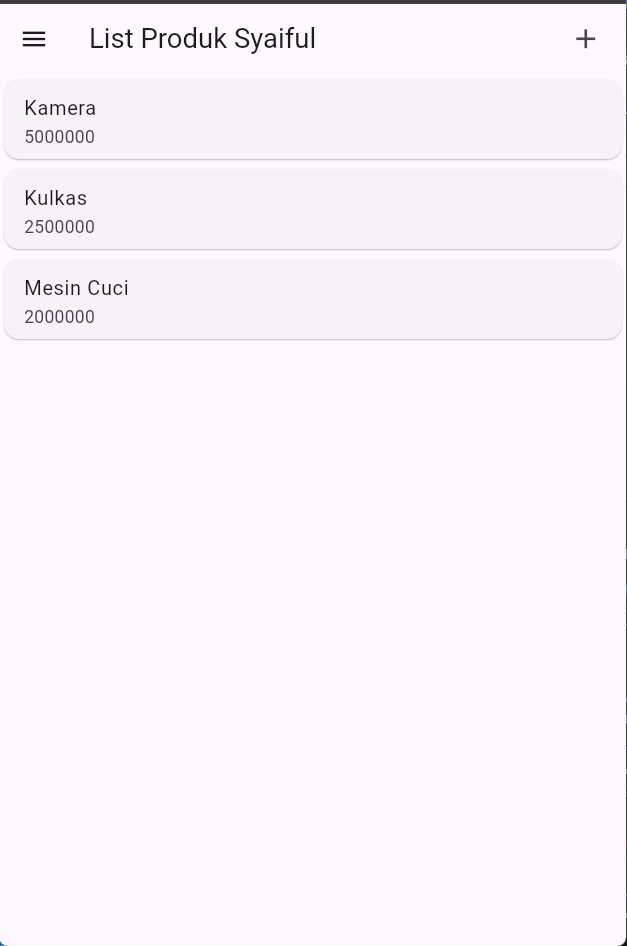
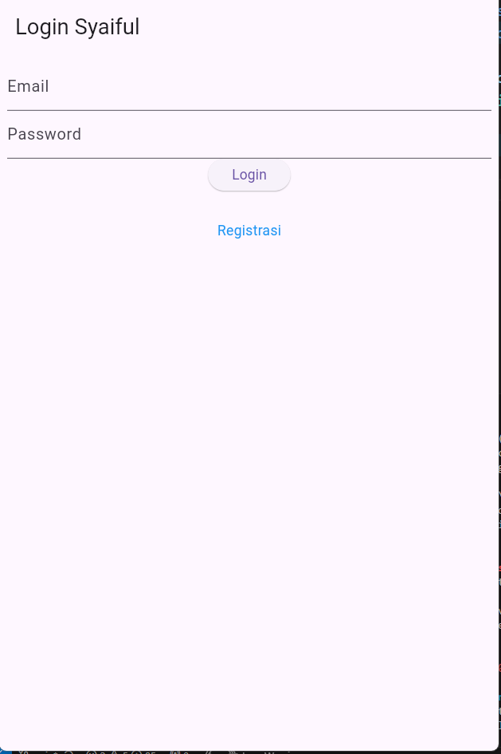
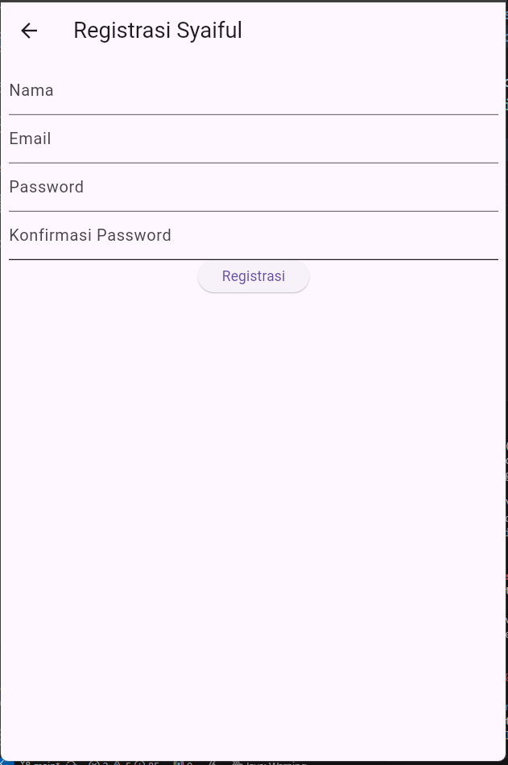

# toko_kita

Nama : Muhammad Syaiful Latif
NIM : H1D022025
Shift baru : E

Foto

1. proses register
-Pengguna mengisi formulir registrasi dengan tiga input: nama, email, dan password.

Masing-masing dikelola oleh TextEditingController:
_namaTextboxController untuk nama
_emailTextboxController untuk email
_passwordTextboxController untuk password

- Validator untuk setiap input:

Nama: Minimal 3 karakter.
Email: Wajib diisi dan valid.
Password: Minimal 6 karakter.
Konfirmasi Password: Harus sama dengan password yang diinput.

- Ketika tombol "Registrasi" ditekan:
Fungsi _submit() dipanggil setelah validasi berhasil.
Jika validasi sukses dan tombol tidak dalam status loading:
Proses registrasi dimulai dengan memanggil RegistrasiBloc.registrasi untuk mengirim data ke backend.

- Setelah registrasi:
Jika berhasil: Menampilkan dialog sukses dengan SuccessDialog.
Jika gagal: Menampilkan dialog peringatan dengan WarningDialog.

2. proses login
- Pengguna memasukkan email dan password di form yang disediakan.

Input ini dikelola oleh TextEditingController:
_emailTextboxController untuk email
_passwordTextboxController untuk password

- Setelah mengisi email dan password, pengguna menekan tombol "Login" (_buttonLogin).

Tombol ini memanggil metode _submit() saat ditekan.
Dalam _submit(), form divalidasi dengan:
Mengecek apakah form valid menggunakan _formKey.currentState!.validate().
Memastikan proses loading (_isLoading) tidak sedang berlangsung.

- Setelah validasi berhasil:

Fungsi LoginBloc.login() dipanggil dengan parameter email dan password yang diinput oleh pengguna.
Fungsi ini mengembalikan Future, dan menggunakan .then() untuk menangani respons.

- Jika login berhasil:

Jika value.code sama dengan 200:
Token dan ID pengguna disimpan menggunakan kelas UserInfo.
Dialog sukses ditampilkan menggunakan SuccessDialog untuk memberi tahu bahwa login berhasil.
Setelah pengguna menekan tombol "OK" di dialog sukses, mereka akan diarahkan ke halaman produk (ProdukPage).

- Jika respons dari server tidak berhasil (misalnya, jika kode yang diterima bukan 200), atau jika terjadi kesalahan selama proses login yang ditangani oleh .catchError(), maka dialog peringatan akan ditampilkan menggunakan _showWarningDialog(). Dialog ini akan memberi tahu pengguna bahwa proses login telah gagal, sehingga pengguna dapat mengambil tindakan lebih lanjut atau mencoba kembali.

3. proses ubah data
- Di halaman ProdukPage, pengguna dapat melihat daftar produk yang tersedia. Saat pengguna mengklik salah satu produk, mereka akan diarahkan ke halaman detail produk.
- Ketika pengguna menekan tombol "EDIT", aplikasi akan mengarahkan mereka ke halaman ProdukForm dengan mengirimkan objek produk yang dipilih. Di halaman ProdukForm, pengguna dapat mengedit data produk, seperti nama, harga, dan informasi lainnya.
- Setelah pengguna menyelesaikan pengeditan dan menekan tombol simpan, produk akan diperbarui di database melalui ProdukBloc. Proses penyimpanan ini memastikan bahwa data yang dimasukkan valid, dan juga memperbarui status aplikasi jika diperlukan. Sebagai contoh, jika harga monitor berhasil diubah, data yang ditampilkan di ProdukPage akan ter-update secara otomatis.

4. proses hapus data
- Ketika pengguna mengklik tombol "DELETE", fungsi confirmHapus() akan dipanggil. Fungsi ini akan menampilkan dialog konfirmasi yang menanyakan kepada pengguna apakah mereka yakin ingin menghapus data.
- Jika pengguna mengonfirmasi dengan menekan tombol "Ya", sistem akan memanggil metode deleteProduk pada ProdukBloc, menggunakan ID produk yang ingin dihapus.
-Jika proses penghapusan berhasil, maka aplikasi akan kembali ke halaman ProdukPage untuk memperbarui daftar produk. Namun, jika penghapusan gagal, dialog peringatan akan muncul, memberi tahu pengguna bahwa penghapusan telah gagal. Setelah proses penghapusan tadi, di halaman ProdukPage akan terlihat bahwa data produk tidak ada atau berhasil dihapus.

5. proses tambah data
- Di halaman ProdukPage, ketika pengguna menekan simbol "+" yang berada di kanan atas, aplikasi akan mengarahkan pengguna ke halaman ProdukForm. Halaman ini menyediakan beberapa kolom input untuk mengumpulkan informasi mengenai produk baru, seperti nama produk, harga, dan kode produk. Umumnya, widget seperti TextField digunakan untuk input teks.
- Pengguna kemudian mengisi formulir di ProdukForm dan menekan tombol "SIMPAN". Ketika tombol tersebut ditekan, fungsi _tambahProduk() akan dipanggil untuk memproses penambahan produk baru.
- Jika validasi berhasil, objek produk baru akan dibuat, dan metode dari ProdukBloc akan dipanggil untuk menyimpan produk tersebut ke dalam database. Setelah proses penyimpanan berhasil, pengguna akan kembali ke ProdukPage.
- Saat halaman ProdukPage dimuat kembali, aplikasi akan mengambil data produk dari database dan menampilkannya dalam bentuk daftar. Sebagai contoh, produk "ayam goreng" berhasil ditampilkan di halaman ProdukPage.
6. proses logout
- Di halaman ProdukPage, jika pengguna membuka sidebar maka akan menemukan tombol logout. Ketika pengguna memilih opsi Logout, fungsi LogoutBloc.logout() akan dipanggil. Fungsi ini bertugas untuk menghapus sesi pengguna, misalnya dengan menghapus token otentikasi dari penyimpanan lokal (seperti SharedPreferences).

- Setelah proses logout berhasil, aplikasi akan mengarahkan pengguna kembali ke halaman LoginPage. Di sini, metode Navigator.of(context).pushAndRemoveUntil digunakan untuk menghapus semua rute sebelumnya dari stack, sehingga pengguna tidak dapat kembali ke halaman yang memerlukan otentikasi setelah melakukan logout.

